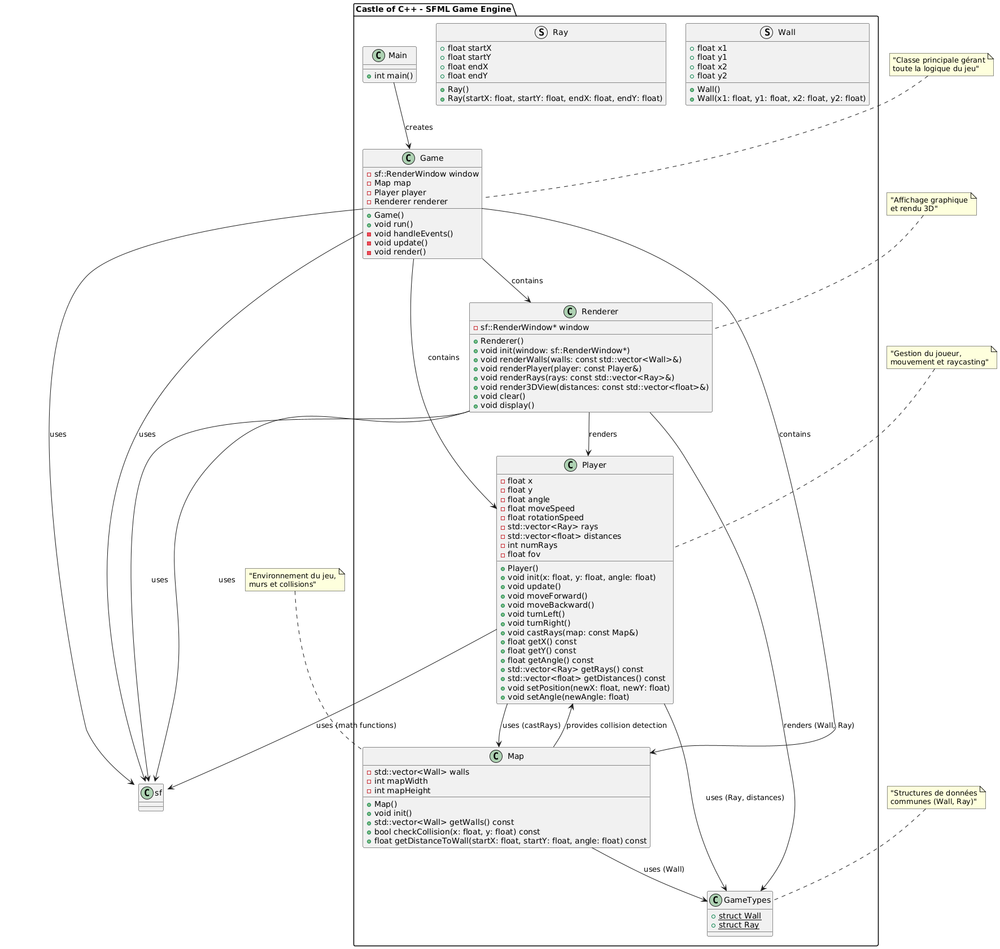

<!-- PROJECT LOGO -->
 

  

  <h3 align="center">Castle of SFML 🏰</h3>

  

    Un jeu de type raycaster 3D développé en C++ avec la bibliothèque SFML
     
    <a href="#about"><strong>Explore the screenshots »</strong></a>
       
       
      <a href="https://github.com/majeurbilly/castle_of_SFML/issues/new?assignees=&labels=bug&template=01_BUG_REPORT.md&title=bug%3A+">Report a Bug</a>
      ·
      <a href="https://github.com/majeurbilly/castle_of_SFML/issues/new?assignees=&labels=enhancement&template=02_FEATURE_REQUEST.md&title=feat%3A+">Request a Feature</a>
      ·
      <a href="https://github.com/majeurbilly/castle_of_SFML/issues/new?assignees=&labels=question&template=04_SUPPORT_QUESTION.md&title=support%3A+">Ask a Question</a>
  

  ## Table of Contents
  <ol>
    <li>
      <a href="#about">About</a>
      <ul>
        <li><a href="#built-with">Built With</a></li>
      </ul>
    </li>
    <li>
      <a href="#getting-started">Getting Started</a>
      <ul>
        <li><a href="#prerequisites">Prerequisites</a></li>
        <li><a href="#installation">Installation</a></li>
      </ul>
    </li>
    <li><a href="#usage">Usage</a></li>
    <li><a href="#monitoring-tools-overview">Monitoring Tools Overview</a></li>
    <li><a href="#authors--contributors">Authors & Contributors</a></li>
    <li><a href="#acknowledgments">Acknowledgments</a></li>
  </ol>

<!-- ABOUT THE PROJECT -->
## About

**Castle of SFML** est un moteur de jeu 3D de type raycaster inspiré des classiques comme Wolfenstein 3D. Le projet implémente un système de rendu 3D en temps réel utilisant la technique du raycasting pour créer l'illusion de profondeur et d'espace 3D.

### Fonctionnalités principales

- **Système de rendu 3D** : Affichage en temps réel d'un environnement 3D
- **Gestion des collisions** : Détection automatique des murs et obstacles
- **Contrôles fluides** : Mouvement et rotation du joueur
- **Architecture modulaire** : Code organisé en classes séparées (Game, Player, Map, Renderer)
- **Rendu des rayons** : Visualisation des rayons pour le débogage

### Architecture du projet

- **Game** : Classe principale gérant la boucle de jeu
- **Player** : Gestion du joueur, mouvement et casting des rayons
- **Map** : Définition de l'environnement et gestion des collisions
- **Renderer** : Affichage graphique et rendu 3D
- **GameTypes** : Structures de données communes (Wall, Ray)

 

    
 

 
🛠️ Installation Process  

### Built With

- **C++** - Langage de programmation principal
- **SFML 2.6** - Bibliothèque multimédia pour le graphisme, audio et entrées
- **Visual Studio** - IDE et compilateur C++
- **CMake** - Système de build et gestion des dépendances

## Getting Started

### Prerequisites

To work with this project, you need to have:

- **Visual Studio 2019 ou plus récent** avec support C++17
- **SFML 2.6** (bibliothèques et headers)
- **Windows 10/11** (développé et testé sur Windows)
- **Git** pour cloner le repository

### Installation

1. Open your **terminal**.
2. Clone le repository : `git clone https://github.com/majeurbilly/castle_of_SFML.git`
3. Install **SFML 2.6** depuis [sfml-dev.org](https://www.sfml-dev.org/download.php)
4. Install **Visual Studio** avec support C++ Desktop Development
5. Run the program:
   Ouvrir `castle_of_SFML.sln` dans Visual Studio et compiler

## Usage

### Compilation et exécution

1. In **Visual Studio**, ouvrir le fichier `castle_of_SFML.sln`
2. Configurer les chemins SFML dans les propriétés du projet
3. Build le projet (Ctrl+Shift+B)
4. Run: F5 pour lancer en mode debug

### Contrôles du jeu

- **ZQSD** ou **WASD** : Déplacement du joueur
- **Souris** : Rotation de la caméra
- **Échap** : Quitter le jeu

## Monitoring Tools Overview

### **Visual Studio Debugger**
- Points d'arrêt et inspection des variables
- Profiling des performances
- Analyse de la mémoire

### **SFML Debug Mode**
- Validation des ressources graphiques
- Gestion des erreurs OpenGL
- Logs de débogage

### **Console Output**
- Affichage des informations de jeu
- Statistiques de performance
- Messages d'erreur détaillés

## Authors & Contributors

**Développeur principal :** [majeurbilly](https://github.com/majeurbilly)

Ce projet est développé dans le cadre d'un apprentissage du développement de jeux vidéo en C++ avec SFML.

## Acknowledgments

Remerciment:

* [SFML Team](https://www.sfml-dev.org/) - Bibliothèque multimédia exceptionnelle
* [Visual Studio](https://visualstudio.microsoft.com/) - IDE puissant pour le développement C++
* [Wolfenstein 3D](https://fr.wikipedia.org/wiki/Wolfenstein_3D) - Inspiration pour le style de jeu raycaster

(<a href="#readme-top">back to top</a>)

